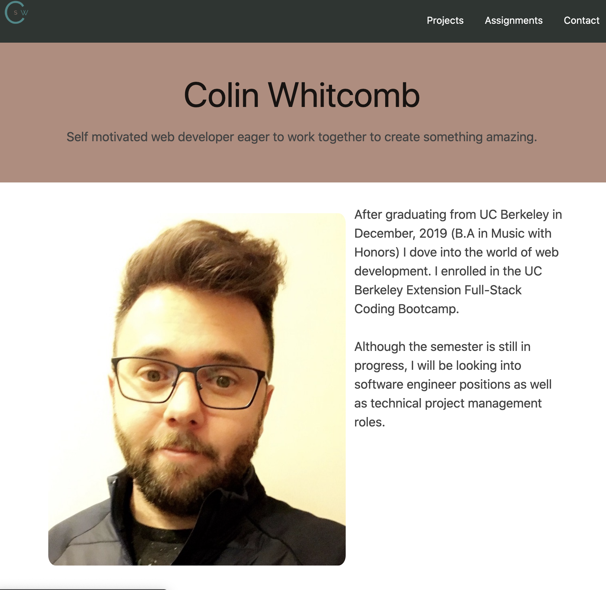
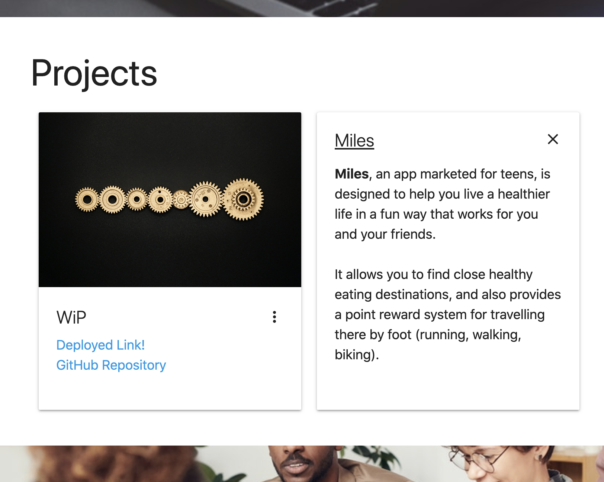
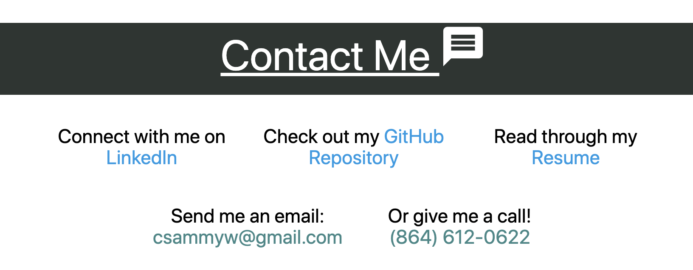

# Portfolio_84

<h2 align="center">
Deployed <a href="https://pacific-sea-84511.herokuapp.com/">Site</a>
</h2>

    

## Summary & Processs

In this assignment our objective was to update our portfolio pages. I maintained a similar framework from before; however, I made some changes.

I took a completely different outlook for UI and design. I condensed the site into two pages - a landing site and a home page. The home page holds everything that a recruiter/employer needs (i.e. short bio, preview of past work, and easily accessible ways to connect). Unlike previous portfolios, this iteration does take advantage of Node.js to send static HTML files.

To advance my understanding of the framework I used <a href="https://materializecss.com/">Materialize</a> again, and was able to implement some nice features (better cards and Parallax).

## Screenshots 

<h3 align="center">
Short Bio
</h3>

    

<h3 align="center">
Project Cards
</h3>

    

<h3 align="center">
Contact
</h3>

    

## Technologies / Resources
- Node.js
- Materialize 
- HTML / CSS  
- Visual Studio Code
- Git / GitHub / GitPages

## Author

**Colin Whitcomb** [LinkedIn](https://www.linkedin.com/in/colin-whitcomb-b808301a6/)